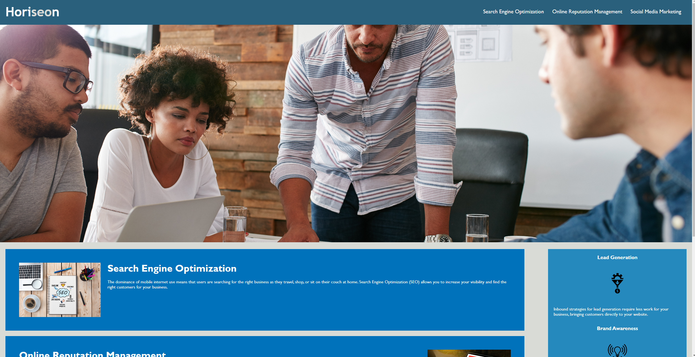

# Refactored Horiseon Website

## Description

The starter code provided a solid framework for conveying information related to growing an online business, but its source code was lacking in few key areas. The accessibility needs for some users had to be addressed, as well as some minor bugs and readibility issues. My job was to solve these problems and refactor the source code. I renamed div elements to more descriptive semantic counterparts, fixed various errors in the code such as a reference links to non-existant ids, and consoldiated and cleaned up the style.css file. I learned about different semantic element tags to use for different situations as well as proper styling for .css files.    

## Webpage 

 

 ## Link

 https://danieltbonn.github.io/horiseon-accessibility-refactor/